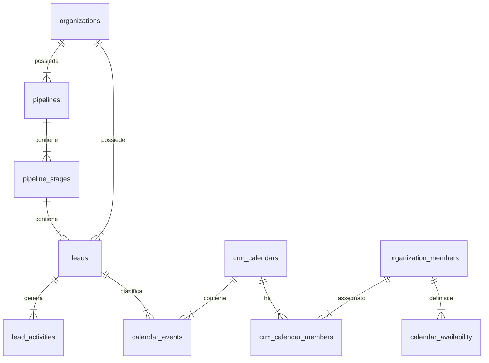

# Architettura CRM, Gestione Pipeline e Presa Appuntamenti (Metodo Sincro)

Questo documento descrive in dettaglio l'intera infrastruttura del CRM, della gestione delle pipeline, dell'assegnazione dei lead (Round-Robin) e del sistema di prenotazione degli appuntamenti con integrazione Google Calendar e tracciamento Meta Conversions API (CAPI). 

È strutturato come specifica tecnica e guida di riferimento per replicare fedelmente queste logiche in altri applicativi del gruppo.

---

## 1. Mappatura del Database (Schema Supabase)

L'infrastruttura si poggia su un database relazionale strutturato in modo da supportare pipeline flessibili, log delle attività degli operatori e disponibilità orarie complesse.



### A. Gestione Pipeline e Fasi (`pipelines`, `pipeline_stages`)
Le pipeline definiscono il flusso di vendita. Le fasi (stages) indicano lo stato di avanzamento del lead.

* **`pipelines`** (Definizione delle pipeline, es. "Commerciale", "Supporto")
  * `id` (UUID): Chiave primaria.
  * `organization_id` (UUID): ID dell'organizzazione multi-tenant.
  * `name` (text): Nome della pipeline.
  * `slug` (text): Stringa URL-friendly.
  * `is_default` (boolean): Se impostata su true, accoglie i lead in ingresso per impostazione predefinita.
  * `color` (text): Colore esadecimale per la UI.

* **`pipeline_stages`** (Le singole colonne o fasi all'interno di una pipeline)
  * `id` (text): ID univoco (es. `leads_initial`, `appuntamento_fissato`).
  * `pipeline_id` (UUID): Chiave esterna su `pipelines`.
  * `organization_id` (UUID).
  * `name` (text): Nome visibile della colonna (es. "Lead Inbound", "Consulenza Effettuata").
  * `sort_order` (int): Posizione ordinata da sinistra a destra.
  * `is_won` (boolean): Indica se questa fase rappresenta una vendita completata (es. "Abbonato").
  * `is_lost` (boolean): Indica se questa fase rappresenta un lead perso (es. "Non Interessato").
  * `fire_capi_event` (boolean): Se impostato su true, lo spostamento in questa fase invia automaticamente un evento di conversione server-side (Meta CAPI) per ottimizzare le campagne pubblicitarie.

### B. Anagrafica e Tracciamento Leads (`leads`)
La tabella centrale che ospita i dati dei contatti, l'attribuzione marketing e gli esiti dei Closer/Setter.

* **`leads`**
  * `id` (UUID): Chiave primaria.
  * `organization_id` (UUID).
  * `pipeline_id` (UUID) / `stage_id` (text): Fasi attuali di posizionamento del lead.
  * `name` (text): Nome e cognome del contatto (es. nome genitore).
  * `email` (text) / `phone` (text): Canali di contatto univoci per la deduplicazione.
  * `assigned_to` (UUID): ID dell'operatore attualmente assegnato per la gestione (Setter o Closer).
  * `setter_id` (UUID): L'operatore (Setter) che qualifica il lead.
  * `closer_id` (UUID): Il consulente (Closer) che esegue la trattativa commerciale.
  * `value` (numeric): Valore economico stimato o effettivo dell'opportunità.
  * `utm_source`, `utm_campaign`, `source_channel` (text): Dati di tracciamento marketing.
  * `meta_data` (jsonb): Campo chiave flessibile per salvare dati specifici del modulo (es. età del figlio, risposte del questionario, note personalizzate).
  * `closer_appt_status` (text): Stato dell'appuntamento (es. `no_show`, `eseguito`, `riprogrammare`).
  * `closer_outcome` (text): Esito commerciale (es. `won`, `lost`, `pending`).
  * `esito` (text): Annotazione testuale rapida sull'ultimo contatto.

### C. Log Storico Attività (`lead_activities`)
Tiene traccia di ogni interazione e cambio di fase del lead per consentire l'audit e il calcolo delle metriche di performance.

* **`lead_activities`**
  * `id` (UUID).
  * `lead_id` (UUID): Chiave esterna su `leads`.
  * `user_id` (UUID): L'operatore che ha effettuato l'azione (se nullo, l'azione è del sistema/AI).
  * `activity_type` (text): Tipo di attività (es. `stage_change`, `note_added`, `call_scheduled`, `whatsapp_sent`).
  * `from_stage_id` / `to_stage_id` (text): Popolati in caso di cambio di fase.
  * `notes` (text): Testo della nota o descrizione dell'attività.
  * `meta_data` (jsonb): Payload aggiuntivo (es. dettagli dell'evento programmato).
  * `created_at` (timestamp).

### D. Configurazione Calendario ed Eventi (`crm_calendars`, `crm_calendar_members`, `calendar_availability`, `calendar_events`)
* **`crm_calendars`**: Contiene la durata, i buffer e l'URL di redirezione per ciascun tipo di appuntamento.
* **`crm_calendar_members`**: Mappa quali consulenti (Closer) sono attivi su quel calendario, includendo una `priority` numerica.
* **`calendar_availability`**: Definisce i giorni (`day_of_week`) e le ore ricorrenti in cui ogni closer è disponibile.
* **`calendar_events`**: Salva le prenotazioni confermate sul database locale, tenendo traccia dell'`assigned_to`, del `lead_id` e del `google_event_id` dell'evento creato nel calendario remoto Google.

---

## 2. Logica di Caricamento Disponibilità (Availability Engine)

L'endpoint `/api/public/calendar/[slug]/availability` calcola e mostra al cliente solo gli slot orari in cui c'è **almeno un consulente libero**.

### Algoritmo di calcolo degli slot disponibili:
1. **Generazione Finestra Temporale:** Si imposta l'intervallo per i successivi 14 giorni a partire da oggi (`startDate` ➡️ `endDate`).
2. **Generazione degli Slot Teorici:** Per ciascun giorno e per ciascun agente attivo sul calendario, si leggono le regole di disponibilità settimanale (`calendar_availability`). Si suddivide il tempo in blocchi uguali a `slot_interval_minutes`.
3. **Controllo dei Conflitti e Buffer di Sicurezza:** Uno slot viene marcato come **occupato** per l'agente se si sovrappone a impegni locali o remoti:
   * **Impegni Locali (`calendar_events`):** Eventi già confermati sul DB locale per lo stesso closer.
   * **Impegni Google Calendar (`Free/Busy API`):** Chiamate in tempo reale a Google per verificare eventi esterni sull'agenda personale del closer.
   * **Calcolo del Buffer:** Se il calendario ha un `slot_buffer_minutes` di `15`, uno slot di 30 minuti (es. 10:00-10:30) viene considerato non disponibile se l'agente ha un qualsiasi impegno che tocca la finestra allargata dalle **09:45 alle 10:45**.
4. **Aggregazione:** Gli slot orari che hanno almeno un closer disponibile vengono restituiti in risposta raggruppati per giorno.

---

## 3. Motore di Assegnazione Automatico (Round-Robin & Weighted Routing)

L'assegnazione automatica avviene sia in fase di prenotazione appuntamento (assegnazione Closer) che in fase di ricezione lead da form contatti (assegnazione Setter). 

Il codice in `lib/lead-routing.ts` implementa due modalità di distribuzione automatica:

### A. Modalità Round-Robin (Alternanza Semplice)
1. Recupera la lista di tutti i membri del team abilitati alla rotazione (`in_round_robin = true`), ordinati cronologicamente per data di ingresso (`joined_at ASC`).
2. Legge dalle impostazioni dell'organizzazione l'ID dell'ultimo utente assegnato (`last_assigned_user_id`).
3. Individua l'indice di questo utente all'interno dell'elenco ordinato:
   * Se l'utente si trova in mezzo all'elenco, assegna il lead all'operatore immediatamente successivo (`index + 1`).
   * Se era l'ultimo dell'elenco o non vi è uno storico, riparte dal primo operatore in lista (`index = 0`).
4. Aggiorna il record dell'organizzazione salvando il nuovo `last_assigned_user_id`.

### B. Modalità Pesata (Weighted Distribution)
1. Legge le percentuali o i pesi assegnati a ciascun utente (es. `{"user_A": 60, "user_B": 40}`).
2. Calcola la somma totale dei pesi attivi.
3. Genera un numero casuale compreso tra zero e il totale calcolato.
4. Distribuisce il lead scorrendo la lista e sottraendo il peso di ciascun utente dal numero generato finché quest'ultimo non scende a zero o meno. L'utente corrente riceve l'assegnazione.

---

## 4. Flusso di Esecuzione Asincrono (Submit & Booking Workflow)

Per garantire una UX ottimale e tempi di risposta istantanei (sotto i 200ms), le operazioni pesanti vengono delegate a processi in background utilizzando la funzionalità `after(...)` di Next.js:

```
[Utente invia Form] 
       │
       ▼
1. Salva dati grezzi in 'funnel_submissions' (Sincrono)
2. Invia risposta immediata '200 OK' al Browser (Sincrono)
       │
       ▼ ────[ Esecuzione in Background con after() ]────
       │
3. Deduplica ed elabora il Lead:
   ├─ Se email/telefono corrispondono ad un record esistente:
   │  └─ Riattiva il Lead, aggiorna meta_data e lo sposta al primo Stage.
   └─ Se non esiste:
      └─ Crea un nuovo record nella tabella 'leads'.
4. Assegna il Lead in Round-Robin ad un Setter.
5. Sincronizza i dati inserendo una riga in Google Sheets.
6. Invia notifiche Telegram (al gruppo e chat diretta del Setter assegnato).
7. Esegue chiamata Meta Conversions API per tracciare l'evento server-side.
```

---

## 5. Linee Guida per la Replicabilità in altri Software

Se si desidera sviluppare un nuovo modulo, software o microservizio per il gruppo Sincro che gestisca contatti o appuntamenti, è obbligatorio implementare questi standard:

1. **Deduplicazione basata su Email e Telefono:**
   * Non creare mai lead duplicati se condividono lo stesso indirizzo email (normalizzato in minuscolo e senza spazi esterni) o lo stesso numero di telefono (pulito da caratteri speciali). Aggiornare sempre il lead preesistente, registrando l'azione nel log storico delle attività.
2. **Uso transazionale del Log delle Attività:**
   * Qualsiasi operazione effettuata su un lead (cambio fase, assegnazione operatore, esito telefonata) deve inserire una riga in `lead_activities` per consentire analisi storiche corrette.
3. **Gestione Token OAuth2 Google:**
   * Google invalida gli access token dopo 60 minuti. Scrivere un middleware o un helper che intercetti le chiamate API verso Google: se l'ora corrente supera `google_token_expiry`, deve effettuare automaticamente un refresh del token e aggiornare il database con il nuovo access token prima di eseguire la sincronizzazione dell'appuntamento.
4. **Tracciamento Server-Side (CAPI):**
   * Ogni qualvolta un lead cambia fase, controllare se la colonna `fire_capi_event` del nuovo stage è impostata su `true`. In tal caso, estrarre dal lead i parametri `utm_source`, `utm_campaign`, l'indirizzo IP del browser, il pixel ID associato al funnel d'origine e inviare l'evento a Meta utilizzando la deduplicazione client-server tramite l'identificativo `event_id` univoco.
5. **Round-Robin con Blocco di Concorrenza:**
   * In caso di forte traffico concorrente, assicurarsi che le transazioni che leggono e aggiornano il parametro `last_assigned_user_id` siano atomiche (es. usando un blocco `SELECT ... FOR UPDATE` a livello SQL o una coda transazionale) per impedire che due lead in arrivo nello stesso millisecondo vengano assegnati allo stesso operatore saltando il turno degli altri.
