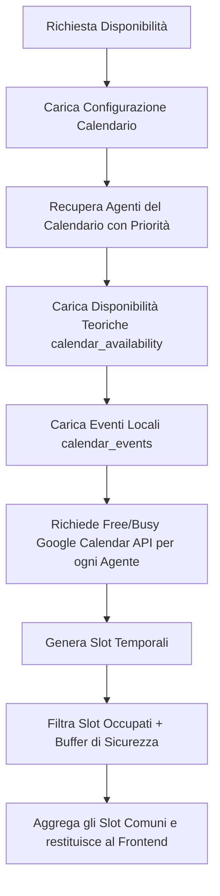

# Architettura di Prenotazione e Gestione Pipeline (Metodo Sincro)

Questo documento descrive il funzionamento dell'infrastruttura di gestione dei calendari, calcolo delle disponibilità in tempo reale, assegnazione automatica (Round-Robin) e gestione dello stato della pipeline dei contatti (Leads). Può essere utilizzato come guida di riferimento e specifica tecnica per replicare queste logiche in altri progetti o microservizi.

---

## 1. Mappatura del Database (Schema Supabase)

L'intero motore si basa su relazioni e vincoli definiti nel database. Di seguito sono elencate le tabelle principali coinvolte:

### A. `crm_calendars`
Definisce le impostazioni globali di ciascun calendario (es. calendario di qualificazione estivo, prenotazione generale, ecc.).
* `id` (UUID): Identificativo unico.
* `organization_id` (UUID): Associazione multi-tenant.
* `name` (text): Nome visualizzato dell'appuntamento (es. "Consulenza Gratuita").
* `slug` (text): URL per accedere alla pagina di prenotazione (es. `/book/consulenza`).
* `description` (text): Testo esplicativo mostrato all'utente.
* `slot_duration_minutes` (int): Durata effettiva della chiamata (es. `30`).
* `slot_interval_minutes` (int): Frequenza degli slot disponibili (es. slot ogni `30` o `15` minuti).
* `slot_buffer_minutes` (int): Tempo di pausa necessario tra un appuntamento e l'altro (es. `15` minuti prima e dopo per evitare sovrapposizioni).
* `redirect_url` (text): Pagina di atterraggio dopo la prenotazione (es. `/grazie`).
* `is_active` (boolean): Flag di stato.

### B. `crm_calendar_members`
Associa i membri del team (consulenti/closers) ad uno o più calendari.
* `id` (UUID).
* `calendar_id` (UUID): Riferimento a `crm_calendars`.
* `user_id` (UUID): Riferimento al profilo dell'agente.
* `priority` (int): Valore per guidare la priorità di assegnazione in caso di disponibilità multiple (es. un valore maggiore riceve prima i lead).
* `is_active` (boolean): Stato attivo/inattivo per escludere temporaneamente un agente (es. ferie).

### C. `calendar_availability`
Definisce i blocchi orari ricorrenti di disponibilità settimanale per ogni agente.
* `user_id` (UUID): Riferimento al profilo dell'agente.
* `day_of_week` (int): Giorno della settimana (`0` per Domenica, `1` per Lunedì, ecc.).
* `start_time` (time): Ora di inizio disponibilità (es. `09:00:00`).
* `end_time` (time): Ora di fine disponibilità (es. `18:00:00`).
* `is_active` (boolean).

### D. `calendar_events`
Memorizza gli appuntamenti confermati presi sul sistema.
* `id` (UUID).
* `organization_id` (UUID).
* `calendar_id` (UUID).
* `closer_id` (UUID): L'agente a cui è stato assegnato il lead.
* `lead_id` (UUID): Riferimento a `leads`.
* `title`, `description` (text).
* `start_time` (timestamp): Data e ora d'inizio in formato ISO.
* `end_time` (timestamp): Data e ora di fine in formato ISO.
* `status` (text): Stato dell'evento (`confirmed`, `cancelled`, `no_show`).
* `google_event_id` (text): ID dell'evento su Google Calendar per poterlo sincronizzare, aggiornare o eliminare da remoto.

### E. `organization_members`
Contiene le credenziali e i token di integrazione OAuth2 per gli account Google Calendar dei singoli agenti.
* `user_id` (UUID).
* `google_access_token` (text).
* `google_refresh_token` (text).
* `google_token_expiry` (timestamp).

---

## 2. Motore delle Disponibilità (Availability Engine)

L'endpoint di consultazione (`/api/public/calendar/[slug]/availability`) calcola dinamicamente gli slot liberi per i successivi 14 giorni. Il flusso segue questo algoritmo:

### Logica Dettagliata dell'Intersezione:
1. **Definizione della finestra temporale:** Si calcola l'intervallo dal giorno corrente (`start`) fino a 14 giorni nel futuro (`end`).
2. **Generazione degli slot teorici:** Per ogni giorno compreso nell'intervallo, si controlla il giorno della settimana (`day_of_week`). Per ciascun agente associato, si prendono le sue disponibilità teoriche (es. `09:00` - `18:00`). Si generano slot consecutivi in base a `slot_interval_minutes`.
3. **Controllo dei Conflitti:** Uno slot viene rimosso per un determinato agente se collide con:
   * **Impegni interni:** Un evento già presente in `calendar_events` per lo stesso `closer_id` che si sovrappone temporalmente.
   * **Impegni esterni:** Eventi del Google Calendar dell'agente ottenuti chiamando l'API `freeBusy` di Google Calendar (previa validazione e aggiornamento dinamico del token OAuth2 scaduto).
   * **Buffer di sicurezza:** Nel calcolo della collisione si estende lo slot occupato aggiungendo `slot_buffer_minutes` prima dell'inizio e dopo la fine (es. se l'agente ha un impegno 10:00-10:30 e il buffer è di 15m, la finestra risulterà bloccata dalle 09:45 alle 10:45).
4. **Aggregazione:** Se almeno un agente è disponibile in uno specifico slot temporale, quello slot viene visualizzato nel frontend. Il frontend riceve l'elenco degli slot aggregati per data.

---

## 3. Motore di Prenotazione e Round-Robin (Booking Engine)

Quando l'utente seleziona uno slot ed invia i suoi dati, l'endpoint di prenotazione (`/api/public/calendar/[slug]/book`) esegue i seguenti passaggi in modo transazionale:

### Fase 1: Validazione e Assegnazione
* Si calcolano le ore di inizio (`start_time`) e fine (`end_time`) dello slot.
* Si estraggono tutti gli agenti attivi associati al calendario ordinati per `priority DESC` (priorità più alta prima).
* Viene effettuato un doppio controllo di disponibilità in tempo reale per lo slot specifico, verificando l'assenza di eventi su DB e interrogando l'API di Google Calendar per i candidati.
* **Algoritmo di Round-Robin con Priorità:** Il sistema assegna l'evento al primo agente che supera tutti i controlli di disponibilità nell'ordine di priorità stabilito. Se più agenti sono liberi nello stesso slot, l'agente con priorità più alta riceve l'appuntamento.

### Fase 2: Gestione del Lead
* Si effettua una ricerca per verificare se il lead (tramite l'indirizzo email) esiste già nel database dell'organizzazione.
* **Se esiste:** Si recupera l'ID del lead esistente.
* **Se NON esiste:**
  1. Si cerca lo stage della pipeline deputato alla presa appuntamenti (solitamente denominato `"Appuntamento"` o `"Consulenza Prenotata"`).
  2. Viene inserito un nuovo record nella tabella `leads` agganciandolo a quel determinato `stage_id` e `pipeline_id`.

### Fase 3: Creazione dell'Evento e Sincronizzazione Remota
* Viene registrato l'appuntamento nella tabella locale `calendar_events` con lo stato `confirmed` e il riferimento al lead e all'agente assegnato.
* Viene inviata una chiamata API asincrona per creare l'evento direttamente sul Google Calendar dell'agente assegnato:
  * L'evento include nel corpo i dati di contatto (nome, telefono, email e note dell'utente).
  * Viene impostato l'utente come invitato (attendee) per generare il link di Google Meet automatico.
  * Il codice recupera l'ID dell'evento restituito da Google (`google_event_id`) e lo salva nel database locale su `calendar_events`. Questo passaggio è fondamentale per consentire modifiche, aggiornamenti o cancellazioni bidirezionali dell'evento.

### Fase 4: Notifiche e Redirezione
* Viene inviata una notifica email/Telegram all'agente assegnato (closer) contenente tutti i dati del lead.
* Il server risponde al frontend inviando il link di redirezione impostato nel calendario (`redirect_url` o un fallback standard come `/grazie`).

---

## 4. Requisiti di Integrazione per Altri Software

Se desideri replicare questa architettura in altre piattaforme o servizi esterni, ecco i punti chiave da implementare:

1. **Gestione del Token OAuth2 Google:**
   * Implementare una routine di token-refresh prima di ogni chiamata `Free/Busy` o di creazione evento. Se il timestamp corrente supera `google_token_expiry`, richiedere un nuovo `access_token` tramite il `refresh_token` memorizzato.
2. **Ottimizzazione delle Performance (Caching):**
   * Le chiamate `Free/Busy` alle API di Google possono rallentare l'interfaccia utente (fino a 1-2 secondi di latenza). Per ottimizzare il caricamento del calendario, valuta di memorizzare in una cache (es. Redis) le risposte Free/Busy degli agenti per un tempo limitato (es. 5-10 minuti).
3. **Gestione della Concorrenza (Race Conditions):**
   * Se due utenti provano a prenotare contemporaneamente lo stesso identico slot con lo stesso unico agente disponibile, il sistema deve sollevare un errore di conflitto (`409 Conflict`) per il secondo utente prima di scrivere l'evento nel DB, costringendolo a scegliere un nuovo orario.
4. **Attribution UTM & Tracking CAPI:**
   * Durante la fase di booking, è fondamentale salvare i dati dei cookie (`fbp`, `fbc`, `utm_source`, ecc.) passandoli nel payload dell'evento di prenotazione. Questo permette di lanciare gli eventi di conversione server-side (Meta Conversions API) per tracciare il ROI delle campagne pubblicitarie in modo accurato.
