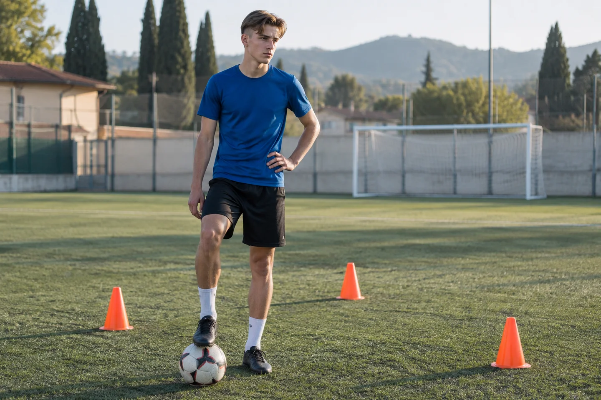
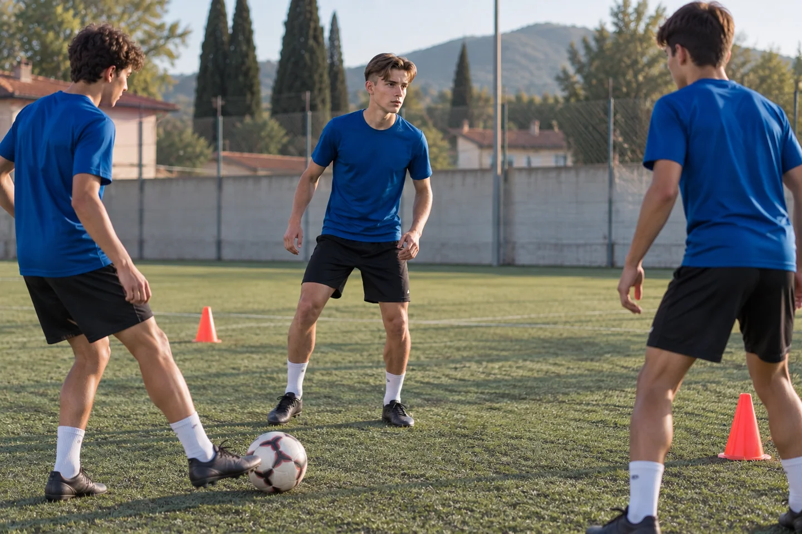

# Si allena anche da solo. Perché in partita continua a trattenersi?

Si impegna, aggiunge esercizi e vuole migliorare. Ma in partita esita ancora. Prima di un’altra lezione, come capire se il bisogno riguarda il gesto, il ruolo, le decisioni o la paura di sbagliare.

[Leggi l’articolo pubblicato](https://landing.metodosincro.com/blog/allenamento-extra-partita)

Il pallone è in macchina anche nei giorni senza allenamento. Tuo figlio trova un campo libero, ripete un controllo, cerca qualcuno con cui provare. Quando torna, ha ancora voglia di fare.

Immagina questa scena, costruita a titolo illustrativo: ha sedici o diciassette anni e sta aggiungendo lavoro perché desidera giocare meglio. Tu gli dai passaggi, trovi il tempo per accompagnarlo o valuti un'altra lezione individuale.

Poi arriva la partita. Riceve in una situazione che sembra conoscere, esita e sceglie di liberarsi subito del pallone. Tornando a casa dice che deve allenarsi ancora di più.

La sua determinazione ti colpisce. Ma cominci a chiederti: **gli stiamo dando ciò che gli serve, oppure stiamo aumentando uno sforzo che non risponde alla difficoltà di gara?**

Quella domanda merita spazio prima di riempire un'altra casella della settimana.

## Più lavoro ha valore quando sai a che cosa serve

L'allenamento aggiuntivo può essere utile. Migliorare un gesto, sviluppare una capacità o chiarire un movimento sono obiettivi concreti, da impostare con chi ha le competenze per farlo.

Il dubbio nasce quando la richiesta diventa soltanto «fare di più». Più controlli, più ripetizioni, un'altra seduta. Senza aver capito perché, in partita, il ragazzo rinunci a usare ciò su cui lavora.

Può mancargli ancora una competenza. Può non riconoscere la situazione abbastanza presto. Può ricevere indicazioni che da fuori non conosci. Oppure può temere il giudizio su un eventuale errore.

Sono possibilità differenti. Se le chiamiamo tutte «poca fiducia», rischiamo di scegliere un aiuto prima di aver individuato il bisogno.

## Il gesto che riesce da solo cambia quando ci sono gli altri

In un esercizio individuale tuo figlio conosce la sequenza. In partita deve leggere compagni, avversari, spazi e richieste del ruolo, mentre il gioco si muove.

Per questo riuscire in un esercizio e riuscire in gara non sono la stessa verifica. Il trasferimento va valutato anche sul piano tecnico e tattico con l'allenatore.

Poi c'è il significato che il ragazzo può dare all'azione. Se pensa «con tutto quello che mi alleno non posso sbagliare», ogni pallone diventa anche una verifica del proprio impegno. L'errore può sembrargli una smentita di ore di lavoro.

È una possibile dinamica da ascoltare, non una conclusione che possiamo ricavare guardandolo dalla tribuna.

## Il costo di aggiungere senza mettere a fuoco

Se ogni delusione porta automaticamente a un allenamento in più, la famiglia può continuare a impegnare tempo e denaro senza sapere che cosa dovrebbe cambiare.

Un pomeriggio va organizzato, uno spostamento aggiunto, una lezione pagata. Il ragazzo può arrivare alla partita con un'altra aspettativa: «Adesso devo riuscirci, ho fatto tutto».

Il problema non è il desiderio di lavorare. È la mancanza di una priorità che colleghi lo sforzo alla difficoltà osservata. Quando questa manca, anche valutare un miglioramento diventa difficile: guardate soltanto se ha giocato bene o male.

Prima di decidere un nuovo impegno, può essere utile nominare una situazione precisa e chiarire con chi la segue quale lavoro abbia senso.

## Una domanda da portare alla prossima conversazione

Invece di partire da «ti serve allenarti di più», prova a capire **che cosa succede nel momento in cui decide di trattenersi**.

Immagina un dialogo illustrativo in un momento scelto insieme: «Nell'azione in cui hai restituito subito il pallone, che cosa avevi visto?». Può raccontare che un compagno gli aveva chiesto il passaggio, che non sapeva dove muoversi oppure che temeva di perderlo.

La stessa azione osservata da fuori può avere spiegazioni diverse. Ascoltare la risposta evita di correggere una scelta senza conoscere il compito.

Se non ha voglia di parlarne subito, potete concordare un altro momento. L'obiettivo della conversazione è comprendere, non ottenere una confessione di insicurezza o aggiungere una valutazione alla partita.

## Un caso raccontato da un genitore mostra il dubbio

Nella [discussione Helping my son](https://www.reddit.com/r/youthsoccer/comments/1kh6rs2/helping_my_son/), un genitore descrive allenamento extra e timore dell'errore nel figlio quindicenne. Cita anche un ruolo poco familiare. È un racconto estero non verificato: suggerisce domande da approfondire e non dimostra che serva un percorso di coaching.

Per la vostra famiglia il criterio resta concreto: il lavoro aggiuntivo risponde a qualcosa che avete identificato? Chi lo segue conosce la difficoltà che emerge nella gara? Il ragazzo capisce perché sta facendo quell'attività?

Puoi sostenere il suo impegno anche aiutandolo a collegarlo a una priorità chiara, senza interpretare ogni prestazione come una misura della volontà che ci mette.

## Quando la paura dell'errore è un aspetto su cui lavorare

Immagina, come esempio didattico, che il ragazzo racconti questo: sa quale scelta vuole provare, ma si ferma perché pensa alla reazione della panchina se perde palla.

In quel caso c'è un passaggio su cui un lavoro mentale può concentrarsi. Si ricostruiscono il pensiero, il momento in cui compare e ciò che accade all'attenzione. Poi si prepara una risposta collegata al compito, da provare e rivedere insieme.

L'obiettivo non è invitarlo a rischiare ogni pallone. Giocare semplice può essere la scelta corretta. Si cerca di aiutarlo a riconoscere quando la decisione nasce dalle informazioni del gioco e quando è dominata dal tentativo di evitare un giudizio.

Anche questa distinzione richiede il suo punto di vista.

## Come si inserisce Metodo Sincro nella settimana del ragazzo

Metodo Sincro, fondato da Antonio Valente, propone sessioni individuali online con un coach dedicato. Il percorso lavora su aspetti come attenzione, gestione della pressione, dialogo interno e risposta all'errore, con pratica fra gli incontri.

Il punto di partenza sono le difficoltà pertinenti di quel ragazzo. Un episodio di gara può diventare materiale da ricostruire, su cui preparare un comportamento e verificare che cosa succede quando prova a usarlo.

Il lavoro deve trovare posto nella sua vita reale, fra scuola, allenamenti e altri impegni. Organizzazione, attività e investimento vanno chiariti prima della scelta. Il coaching non decide la preparazione fisica e tecnica, né garantisce più minuti o una prestazione specifica.

## Tre domande che aiutano a scegliere

### Devo interrompere gli allenamenti extra?

Il testo non permette di stabilirlo. Il programma va valutato con chi segue la preparazione e conosce il ragazzo. La domanda utile è quale obiettivo abbia ogni attività e come si colleghi al resto del lavoro. Il coaching non sostituisce questa valutazione.

### Un mental coach può aiutarlo se non capisce il ruolo?

Le indicazioni sul ruolo spettano all'allenatore. Un eventuale lavoro mentale può riguardare, per esempio, il timore di chiedere chiarimenti o il modo di vivere una correzione. Capire il compito rimane necessario: non basta sentirsi più sicuri per sapere che cosa fare.

### Come evito di aggiungere un altro obbligo?

Ascoltando anche il ragazzo e chiedendo una proposta chiara sull'impegno richiesto. Se lui vive ogni nuovo aiuto come un'altra prova da superare, questo va discusso fin dall'inizio. Il primo confronto con il genitore può servire a valutare come coinvolgerlo e se il lavoro sia pertinente.

## Prima della prossima spesa, mettiamo a fuoco il bisogno

Non devi già sapere se il problema è mentale per fare il primo passo. Puoi partire da ciò che vedi: quanto si impegna, in quale situazione si trattiene e che cosa ha raccontato dopo.

Nel primo confronto gratuito con Metodo Sincro il protagonista sei tu, genitore che vuole scegliere un aiuto sensato. Ripercorriamo l'episodio, i tentativi già fatti e la possibile pertinenza del coaching, per valutare se considerare un investimento nel percorso.

[Voglio capire come aiutarlo](#consulenza)

Il confronto iniziale è gratuito e senza obbligo di acquisto. L'eventuale percorso di coaching è a pagamento; attività, organizzazione e prezzo vengono presentati prima di decidere.
