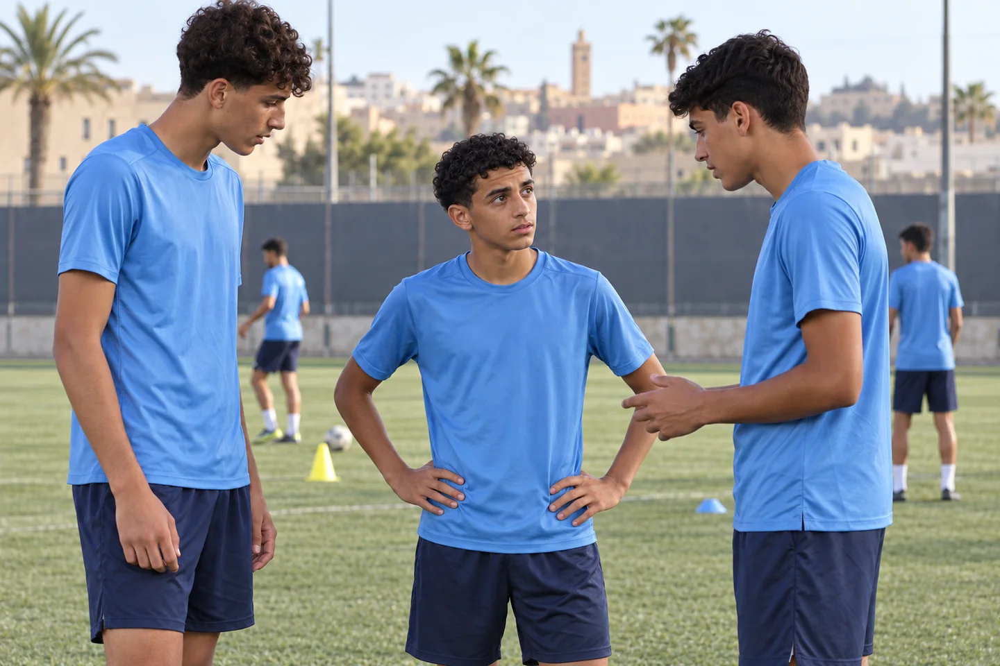
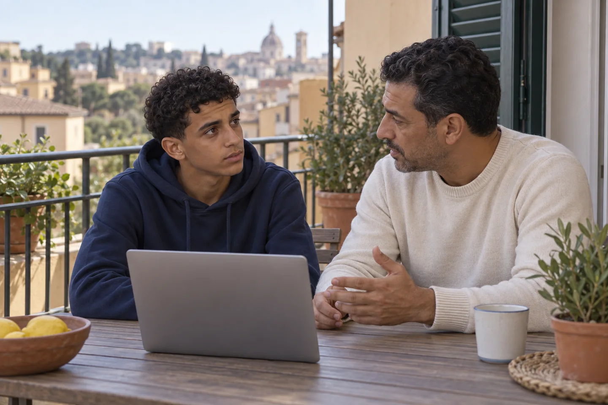

# Gli altri sono cresciuti. Tuo figlio si sente rimasto indietro.

Si confronta con i compagni e sembra leggere ogni difficoltà attraverso il fisico. Come ascoltarlo, cercare riscontri pertinenti e distinguere il lavoro sul confronto dalle valutazioni tecniche e sanitarie.

[Leggi l’articolo pubblicato](https://landing.metodosincro.com/blog/confronto-fisico-calcio-ragazzi)

«Sono tutti più grossi di me.»

La frase può arrivare dopo un contrasto perso, una corsa in cui un compagno lo ha superato o una partita in cui ha giocato poco. Tu provi a spostare il discorso sulle sue qualità. Lui torna lì: «Sì, ma hai visto gli altri?».

Immagina questo dialogo illustrativo con un figlio di sedici o diciassette anni. Fino a qualche tempo fa raccontava il calcio attraverso le giocate. Adesso sembra osservare soprattutto ciò che vede nei compagni e non riconosce in sé.

**Come aiutarlo a confrontarsi con le richieste del campo senza trasformare il confronto fisico in un giudizio su tutto il suo valore?**

Non serve promettergli che presto raggiungerà gli altri. Serve capire che cosa sta vivendo, quali difficoltà concrete incontra e a chi compete valutarle.

## Quando «ho perso un contrasto» diventa «non posso farcela»

Un episodio di gioco può contenere informazioni utili. Può mostrare qualcosa da migliorare o una situazione che richiede una soluzione diversa, da discutere con l'allenatore.

Il problema da esplorare nasce quando il ragazzo salta dall'episodio a una conclusione generale: «Tanto contro quelli non riesco». Da quel momento può leggere anche altre azioni attraverso la stessa idea.

Non possiamo sapere dalla frase se stia parlando di forza, velocità, tecnica, posizione o paura del contatto. Nemmeno una differenza visibile tra due ragazzi basta a spiegarne le prestazioni.

Ascoltare che cosa intende per «rimasto indietro» permette di riportare la conversazione su qualcosa di concreto. È diverso sentirsi meno preparato in una situazione e sentirsi senza possibilità in tutte.

## Il costo può essere smettere di provare prima di aver capito

Immagina, come esempio, che dopo alcuni duelli persi tuo figlio cominci a evitare di proporsi proprio nelle zone in cui teme il confronto. Potresti vedere meno iniziativa, ma non sapere se dipende da indicazioni tattiche o da una rinuncia anticipata.

Se la sequenza si ripete, altre occasioni possono essere affrontate con la convinzione che l'esito sia già deciso. A casa il confronto torna su centimetri, muscoli e compagni, lasciando poco spazio a ciò che è successo davvero in campo.

Il costo per la famiglia può diventare anche la ricerca di un nuovo intervento da pagare, prima di sapere quale bisogno dovrebbe affrontare.

Capire quel bisogno aiuta a scegliere con maggiore precisione.

## Tre piani da tenere distinti

Il primo riguarda **le richieste sportive**. Quali difficoltà osserva l'allenatore? In quali situazioni? Quale lavoro ritiene pertinente? Il suo riscontro può chiarire aspetti che dalla tribuna restano indistinti.

Il secondo riguarda **eventuali dubbi sulla salute o sullo sviluppo fisico**. Questi richiedono il confronto con un professionista sanitario competente. Un advertorial e un mental coach non possono stabilire se un ragazzo sia «in ritardo», né prevedere come cambierà il suo corpo.

Il terzo riguarda **il significato che lui dà al confronto**. Che cosa pensa quando vede il compagno? Quali scelte smette di fare? Come parla delle proprie possibilità?

Questo terzo piano può contenere aspetti pertinenti al coaching. Tenerli distinti evita di attribuire alla mente una difficoltà che richiede un'altra valutazione.

## Una risposta diversa da «vedrai che crescerai anche tu»

Quando lo vedi scoraggiato, promettere che le cose cambieranno può sembrarti il modo più immediato per aiutarlo. Il rischio è lasciare il suo sollievo appeso a qualcosa che non puoi prevedere.

Puoi riconoscere la difficoltà senza formulare quella promessa: «Capisco che questo confronto ti pesi. In quale situazione lo senti di più?».

È un esempio di apertura, da adattare al vostro modo di parlarvi. Potrebbe raccontare un contrasto, una frase sentita nello spogliatoio o il timore di essere valutato soltanto per il fisico.

A quel punto il sostegno può diventare più preciso. Un episodio tecnico può portare a chiedere indicazioni. Una frase offensiva richiede attenzione al contesto. Un giudizio ripetuto su sé stesso può meritare un lavoro sul modo di affrontarlo.

## Un racconto di famiglia, con limiti chiari

In una [discussione pubblica su r/youthsoccer](https://www.reddit.com/r/youthsoccer/comments/1r4x73g/just_a_parent_venting/), un genitore descrive il confronto del figlio con compagni fisicamente più avanti e il calo di fiducia che osserva. Il ragazzo ha dodici anni e il contesto è estero: il racconto non rappresenta i sedicenni italiani e non dimostra l'efficacia del coaching.

Il punto utile è la domanda che fa emergere: come evitare che il confronto con gli altri esaurisca il modo in cui il ragazzo legge la propria esperienza?

Per vostro figlio la risposta va cercata negli episodi attuali, nel suo racconto e nei riscontri di chi lo segue. Nessuna storia altrui può stabilire che cosa gli serva.

## Dal confronto globale a un compito proprio

Immagina un esempio didattico. Il ragazzo dice: «Contro di lui non vinco mai, quindi non ha senso provarci». Un primo lavoro può essere riconoscere quel pensiero e capire che cosa gli fa evitare.

Poi serve un riferimento concreto, coerente con ciò che chiede l'allenatore. Potrebbe riguardare l'attenzione alle informazioni del gioco o la disponibilità a eseguire un compito già chiarito. La scelta va adattata alla situazione, senza inventare soluzioni tattiche da fuori.

Il confronto successivo può riguardare quel comportamento: l'ha cercato? Che cosa è successo? Quali informazioni nuove ha raccolto?

L'obiettivo è aiutarlo a valutare il proprio lavoro con criteri utili. Una prestazione non può essere spiegata soltanto dalla differenza che vede nel corpo di un compagno.

## Il posto del coaching e quello del genitore

Metodo Sincro, fondato da Antonio Valente, propone sessioni individuali online con un coach dedicato, con pratica fra gli incontri. Il lavoro può riguardare dialogo interno, attenzione, pressione e risposta alle difficoltà.

In questa situazione, la pertinenza sta nel modo in cui il ragazzo vive il confronto e nelle conseguenze sui suoi comportamenti. Il percorso non promette cambiamenti fisici, non prescrive programmi di preparazione o alimentazione e non sostituisce chi ne valuta gli aspetti sanitari.

Il genitore può trovare uno spazio per capire come sostenerlo senza diventare il commentatore quotidiano del suo corpo o dei suoi risultati. Anche il ragazzo deve comprendere e condividere il senso dell'eventuale lavoro.

## Tre domande sul confronto con i compagni

### Il mental coaching può compensare una differenza fisica?

Non si può promettere questo risultato. Il coaching può lavorare su aspetti come il giudizio su sé stesso, l'attenzione e la risposta alle difficoltà. La valutazione delle richieste fisiche e della preparazione appartiene ai professionisti competenti che conoscono il ragazzo.

### Devo evitare qualsiasi confronto con gli altri?

Il confronto può far parte del gioco e offrire informazioni. Il punto è capire come viene usato. «Che cosa puoi imparare da quell'azione?» apre una domanda diversa da «perché non sei come lui?». Conta anche come tuo figlio vive queste conversazioni.

### E se chiede lui un lavoro fisico aggiuntivo?

La richiesta va discussa con chi segue la preparazione e, per eventuali dubbi sanitari, con un professionista competente. Puoi anche ascoltare che cosa spera di risolvere: una necessità sportiva precisa o il bisogno di sentirsi finalmente all'altezza. Le due domande possono richiedere risposte diverse.

## Prima di aggiungere un investimento, ascoltiamo che cosa sta succedendo

Potresti desiderare di vederlo entrare in campo senza aver già deciso che il confronto è perso. Per scegliere come aiutarlo, porta un episodio recente: le sue parole, la situazione di gioco, ciò che avete già provato e le indicazioni ricevute.

Il primo confronto gratuito con Metodo Sincro è rivolto a te, genitore che valuta il sostegno e la relativa spesa. Serve a esplorare se ci siano aspetti pertinenti al coaching e se abbia senso considerare quel percorso.

[Voglio capire come aiutarlo](#consulenza)

Il confronto iniziale è gratuito e senza obbligo di acquisto. L'eventuale percorso è a pagamento; attività, organizzazione e prezzo vengono chiariti prima della decisione.
