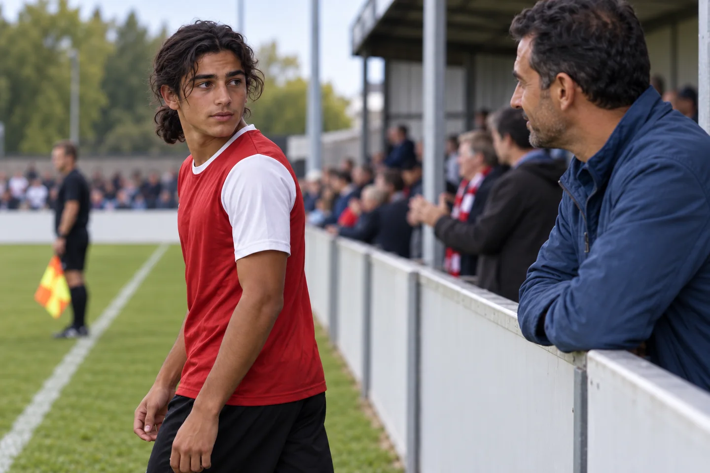
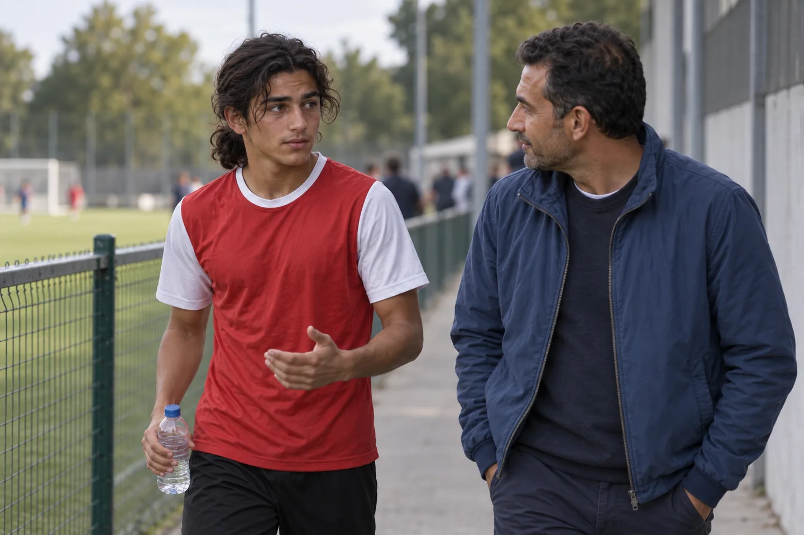

# Dalla tribuna vorresti aiutarlo. Ma lui come vive la tua presenza?

Un richiamo, un applauso, uno sguardo: come arriva a tuo figlio ciò che fai a bordo campo? Una domanda utile prima della prossima partita.

[Leggi l’articolo pubblicato](https://landing.metodosincro.com/blog/genitori-pressione-calcio)

Immagina di essere a bordo campo. Tuo figlio ha diciassette anni, riceve palla e prova una giocata che non riesce. Tu allarghi le braccia: avevi visto un compagno libero. È un gesto breve, poi torni a incitarlo.

Lui guarda nella tua direzione. Tu pensi che stia cercando sostegno. Dopo la partita, però, ti dice: «Quando fai così, mi metti agitazione».

La scena è illustrativa. Potrebbe succedere anche il contrario: ti trattieni per lasciarlo tranquillo e lui ti chiede perché non lo incoraggi più.

**Essere presenti e far sentire sostegno non coincidono sempre nel modo che immagini.** Se ti domandi come aiutare tuo figlio dalla tribuna, il punto di partenza è capire come vive lui la tua presenza.

## Un gesto piccolo può avere significati diversi

Un applauso dopo un errore, un richiamo a voce alta, un'espressione del viso: tu sai che cosa vuoi comunicare. Tuo figlio può interpretarlo diversamente, soprattutto dentro una partita che sente importante.

Questo non significa che ogni gesto del genitore crei pressione. Nemmeno uno sguardo verso la tribuna permette di stabilire che il ragazzo stia cercando approvazione. Potrebbe aver sentito il suo nome, cercare una persona o guardare oltre il campo.

Il problema nasce quando dai per scontato che il tuo messaggio arrivi esattamente come intendi. **Per capire che cosa gli è utile, serve il suo punto di vista.**

A sedici, diciassette o diciotto anni può avere preferenze diverse da quelle che aveva da bambino. Vale la pena conoscerle di nuovo.

## Quando finisci per giocare una seconda partita dalla tribuna

Forse ti accorgi di passare novanta minuti cercando di aiutarlo in ogni decisione. Gli segnali un passaggio, commenti una correzione, osservi chi si scalda in panchina. Alla fine sei esausto quasi quanto lui.

Se questa situazione si ripete, il calcio può occupare il vostro tempo insieme anche attraverso le reazioni del bordo campo: lui contesta ciò che hai gridato, tu spieghi perché lo hai fatto, il resto della partita scompare dentro quella discussione.

Il costo concreto è un altro pomeriggio passato a sorvegliare ogni gesto e un altro rientro dedicato a giustificarsi. Potresti persino decidere di non andare, pur desiderando esserci.

Prima di scegliere fra intervenire continuamente e sparire dalla tribuna, potete cercare **un modo di essere presenti che sia comprensibile a entrambi**.

## Chiedigli che cosa nota, senza suggerire la risposta

In un momento lontano dalla gara, puoi aprire così: «Quando sono a vederti, c'è qualcosa che faccio che ti aiuta? E qualcosa che ti dà fastidio?». È un esempio da adattare al vostro rapporto.

Prova a restare su ciò che racconta. Se dice che lo disturba sentirsi chiamare durante l'azione, chiedigli in quale situazione è successo. Puoi spiegare l'intenzione dopo aver capito l'effetto che descrive.

Se non nota nulla o dice che la tua presenza gli piace, accogli anche questa risposta. L'obiettivo non è fargli ammettere una pressione che hai già deciso esista.

Potete concordare una preferenza concreta per la prossima gara: per esempio, che gli incoraggiamenti restino generali e le osservazioni tecniche vengano lasciate all'allenatore. È un accordo da verificare insieme, non una regola universale.

## Osserva che cosa accade anche a te

La sua partita può coinvolgerti profondamente. Hai visto l'impegno della settimana, sai quanto desidera giocare, ricordi la delusione precedente. Quando sbaglia, può venirti spontaneo cercare di correggere subito il corso delle cose.

Prima della prossima gara, puoi scegliere una cosa tua da osservare: quando cominci a dare indicazioni? Dopo un errore, una sostituzione, un commento vicino a te?

L'osservazione aiuta a riconoscere il momento in cui il tuo coinvolgimento diventa un comportamento visibile. Da lì puoi scegliere una risposta compatibile con l'accordo preso con tuo figlio, per esempio attendere prima di commentare.

**Anche il genitore ha bisogno di un ruolo chiaro.** Non devi controllare ogni emozione per poter assistere alla partita; puoi decidere come esprimerla senza trasformarti in un secondo allenatore.

## Il suo sguardo verso la tribuna non spiega tutta la prestazione

Puoi aver notato che cerca spesso la tua direzione dopo una giocata. È un'osservazione da portare al confronto, non una diagnosi della sua difficoltà.

Il rendimento può dipendere da preparazione, indicazioni tecniche, avversari, stanchezza e molti altri elementi. Attribuire tutto alla famiglia rischia di farvi lavorare sulla domanda sbagliata.

Se il ragazzo racconta che cerca continuamente di capire se sei soddisfatto, allora c'è un tema specifico da esplorare: quale significato dà alla tua reazione e come può tornare al compito di gioco.

In parallelo, potete chiarire il sostegno che gli offri. Sapere che può parlare di una gara difficile senza dover proteggere anche la tua delusione è un obiettivo concreto su cui confrontarsi.

## Dove può essere utile il lavoro di Metodo Sincro

Metodo Sincro®, fondato da Antonio Valente, propone percorsi individuali online per calciatori. Quando sono pertinenti, il lavoro affronta pressione, attenzione, dialogo interno e risposta all'errore, partendo dagli episodi vissuti dal ragazzo.

Per esempio, se racconta di restare concentrato sulle reazioni esterne, si può esplorare come riconosce quel momento e quale richiamo al gioco provare in allenamento. È un esempio didattico, da personalizzare con il coach.

Il percorso considera anche la famiglia: modalità di sostegno, confini dei ruoli e conversazioni intorno alle partite. Il coinvolgimento del genitore può aiutare a rendere coerente ciò che avviene fuori dal campo con il lavoro del ragazzo.

Il traguardo è una maggiore autonomia nell'affrontare le difficoltà sportive. Risultati di squadra, convocazioni e minutaggio restano legati anche a decisioni e fattori esterni.

## Puoi iniziare dal tuo dubbio, senza aver già convinto tuo figlio

Il primo confronto di orientamento è rivolto al genitore che sta valutando l'eventuale percorso e ne sostiene l'investimento. Puoi portare l'episodio che ti ha fatto dubitare: una frase ricevuta dopo la gara, un litigio sul tuo modo di incitare, la difficoltà a capire quanto intervenire.

Si parte da ciò che racconti per chiarire la richiesta e la pertinenza del servizio. Se si considera un lavoro personale con tuo figlio, la sua disponibilità va ascoltata e il suo coinvolgimento costruito in modo trasparente.

Puoi anche leggere le [esperienze pubblicate su Trustpilot](https://it.trustpilot.com/review/valenteantonio.it). Sono racconti individuali; per la tua decisione sarà utile conoscere attività, organizzazione e costo della proposta riferita alla vostra situazione.

## Tre domande sul proprio posto a bordo campo

### Se non vado alle partite, gli tolgo la pressione?

Non è possibile dedurlo senza sapere come vive la tua presenza. Potrebbe desiderarti lì. Prima di scegliere, parlate di ciò che nota e di che cosa gli è utile. Anche i vostri impegni e le possibilità della famiglia contano.

### Devo smettere di incoraggiarlo?

Potete chiarire quali incoraggiamenti apprezza e in quali momenti. Evita di ricavare una regola da una sola reazione: un accordo semplice, seguito da un confronto disponibile, aiuta a capire meglio di un silenzio imposto.

### Il confronto gratuito comprende già il percorso?

No. Il primo confronto di orientamento è gratuito e senza obbligo d'acquisto. Il percorso di coaching è a pagamento. Un'eventuale proposta deve chiarire il lavoro, il coinvolgimento familiare e l'investimento prima della scelta.

## Tornare in tribuna sapendo quale presenza vuoi offrire

Il desiderio può essere semplice: goderti la sua partita, sostenerlo e rientrare a casa senza dover ricostruire ogni tua reazione. Per iniziare, basta portare una situazione concreta e la domanda che ti ha lasciato.

Nel confronto di orientamento puoi capire se il lavoro di Metodo Sincro è pertinente e quale coinvolgimento richiederebbe alla vostra famiglia.

[Voglio capire come aiutarlo](#consulenza)

Primo confronto di orientamento gratuito con il genitore, senza obbligo d'acquisto. Eventuale percorso di coaching a pagamento.
