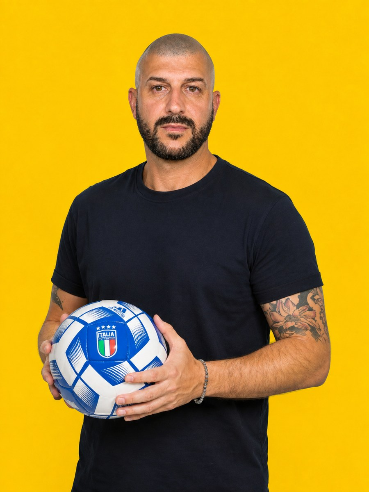

# Prima di investire in un mental coach per tuo figlio, guarda come si lavora davvero.

Episodi concreti, incontri individuali, pratica e coinvolgimento della famiglia: che cosa chiarire prima di scegliere un percorso di mental coaching.

[Leggi l’articolo pubblicato](https://landing.metodosincro.com/blog/mental-coaching-calcio-ragazzi)

Hai capito che ripetergli di credere in sé stesso potrebbe non bastare. Stai valutando un mental coach. Adesso, però, hai bisogno di capire che cosa acquisteresti davvero.

Immagina tuo figlio, diciassette anni: in allenamento prova, in partita si trattiene. Oppure continua a ripensare a un errore anche dopo essere tornato a casa. Sono esempi illustrativi, non diagnosi: prima di scegliere un aiuto, serve capire la situazione concreta.

Per te la domanda è pratica: **come si passa da «deve avere più fiducia» a un lavoro che lui possa svolgere e voi possiate comprendere?**

Un percorso richiede tempo, partecipazione e denaro. Vale la pena vedere da vicino gli elementi su cui basare la decisione.

## Prima del programma, serve un episodio da capire

«In partita non rende» riassume una preoccupazione. Offre però poche informazioni per decidere che cosa approfondire.

Prova a restringere il campo a una situazione recente: che cosa è successo? Che cosa hai osservato? Che cosa ha raccontato tuo figlio? Un passaggio sbagliato, una correzione del mister o un ingresso dalla panchina possono diventare punti di partenza, senza essere automaticamente problemi mentali.

Un ruolo poco chiaro, una preparazione da completare e il timore del giudizio richiedono approfondimenti diversi. Il racconto del ragazzo e il contesto tecnico contano.

**La personalizzazione comincia dalla domanda giusta.** Prima di descrivere ciò che farà il coach, è utile capire quale situazione si sta cercando di affrontare e se tuo figlio desidera lavorarci.

## Che cosa significa lavorare su una difficoltà concreta

Prendiamo un esempio didattico. Dopo un errore, un ragazzo continua a dirsi che verrà sostituito. Nell'azione successiva guarda verso la panchina e perde informazioni sul gioco.

Il confronto con il coach può ricostruire quel momento: che cosa ha notato, che cosa si è detto, dove si è spostata l'attenzione. Poi si può preparare una risposta collegata al suo compito e provarla in allenamento, rispettando le indicazioni tecniche.

Al confronto successivo si torna sull'esperienza: ha riconosciuto il momento? Ha ricordato il richiamo? Era utilizzabile? Che cosa va rivisto?

Questo esempio mostra un possibile processo, non un risultato garantito. Un altro ragazzo potrebbe aver bisogno di affrontare aspettative, concentrazione o rapporto con le correzioni. Il lavoro cambia con ciò che emerge.

## Le sessioni online sono una parte dell'impegno

Metodo Sincro®, fondato da Antonio Valente, propone percorsi con sessioni individuali online e un coach dedicato. La modalità permette di incontrarsi senza aggiungere uno spostamento per la sessione.

Per scegliere con consapevolezza, però, devi conoscere anche ciò che viene richiesto fra gli incontri. Il lavoro comprende la pratica e il confronto su ciò che accade durante la settimana: parlare di una risposta possibile e provarla sono passaggi diversi.

Prima dell'adesione, la proposta deve chiarire frequenza, organizzazione, attività previste e compatibilità con scuola e allenamenti. Questi elementi vanno concordati per il percorso considerato.

**La domanda utile è: «Quale impegno stiamo scegliendo, e come si inserisce nella sua settimana?»** La risposta aiuta a valutare sia il costo sia la sostenibilità concreta per il ragazzo e la famiglia.

## Tu sostieni l'investimento. Lui deve poter partecipare alla scelta

A sedici, diciassette o diciotto anni, tuo figlio ha bisogno di capire il senso di un percorso personale. La tua disponibilità a pagarlo è importante, ma non sostituisce il suo coinvolgimento.

Il primo confronto di orientamento è rivolto a te, il genitore che valuta l'investimento. Puoi chiedere informazioni e raccontare i tuoi dubbi anche se lui non ha ancora deciso che cosa pensa del coaching.

Per l'eventuale lavoro personale, vanno discussi con lui gli obiettivi e la disponibilità a partecipare. Va chiarito anche il ruolo dei genitori: quali confronti sono previsti, come sostenere il lavoro e come rispettare lo spazio del ragazzo.

L'obiettivo del percorso è costruire autonomia. Un controllo familiare su ogni esercizio o su ogni pensiero raccontato al coach rischierebbe di spostare il rapporto nella direzione opposta.

## Come capire su che cosa state lavorando

Il numero di gol o i minuti giocati raccontano solo una parte della situazione. Dipendono anche da ruolo, avversari, scelte dell'allenatore e andamento della squadra.

Per valutare il lavoro, è utile concordare obiettivi più vicini alle azioni del ragazzo. Nell'esempio dell'errore: si accorge quando rimane concentrato su ciò che è già successo? Riesce a provare la risposta concordata? Sa descrivere quando gli è stata utile e quando no?

Sono domande da approfondire con lui e con il coach. Non diventano un esame domestico da ripetere dopo ogni gara.

**Chiedi come vengono definiti e rivisti gli obiettivi**, e quale spazio è previsto per discutere difficoltà o aggiustamenti. Comprendere il processo ti aiuta a valutare la proposta senza attribuirle promesse su titolarità, convocazioni o carriera.

## Le esperienze degli altri aiutano a fare domande migliori

Puoi leggere le [recensioni pubblicate su Trustpilot](https://it.trustpilot.com/review/valenteantonio.it), cercando descrizioni del lavoro: da quale situazione partiva la famiglia, come racconta il rapporto con il coach, quali aspetti considera utili.

Le esperienze individuali non prevedono l'esito di tuo figlio. Possono però aiutarti a individuare le domande che vuoi fare nel primo confronto.

Anche conoscere il fondatore e la struttura del servizio ha un valore. Metodo Sincro è stato fondato da Antonio Valente; l'eventuale proposta deve permetterti di comprendere come viene organizzato il percorso per il ragazzo e chi lo accompagnerà.

La fiducia si costruisce attraverso informazioni coerenti: ciò che leggi nella pagina, ciò che viene spiegato durante il confronto e ciò che sarà previsto nella proposta.

## Prima del prezzo, chiarisci a quale bisogno risponde la spesa

Il costo è una parte legittima della tua decisione. Per valutarlo hai bisogno di conoscere attività, organizzazione, impegno e condizioni della proposta.

Immagina di aver già aggiunto allenamenti individuali perché tuo figlio si sentiva poco sicuro. Se il dubbio riguarda ancora una situazione che non avete capito, un altro acquisto potrebbe continuare la stessa sequenza: spendere prima di chiarire il bisogno. L'esempio non svaluta il lavoro tecnico, che può essere pertinente e necessario.

Il primo confronto serve proprio a orientare questa scelta. Puoi spiegare ciò che avete già provato, ciò che desidera tuo figlio e ciò che la famiglia può sostenere.

**Non serve arrivare convinti che il coaching sia la risposta.** Serve poter capire se la proposta corrisponde alla vostra situazione prima di investire.

## Tre domande prima di scegliere un percorso

### Il coaching sostituisce l'allenamento tecnico?

Il percorso riguarda aspetti come attenzione, pressione, dialogo interno e risposta alle difficoltà, quando pertinenti. Preparazione tecnica e fisica, compiti tattici e scelte di squadra restano nel loro contesto. Un errore in partita, da solo, non stabilisce quale lavoro serva.

### Come capisco se mio figlio è disponibile?

Puoi spiegargli il lavoro con parole concrete e ascoltare le sue domande. Deve poter discutere gli obiettivi e l'impegno senza trovare una decisione già presa. Se è scettico, questo dubbio può entrare nel primo confronto di orientamento con te.

### Quanto costa e che cosa comprende il primo incontro?

Il primo confronto di orientamento con il genitore è gratuito e senza obbligo d'acquisto. Si parte dalla situazione raccontata e dai tuoi dubbi per chiarire la pertinenza del servizio. Il percorso di coaching è a pagamento: attività, organizzazione e investimento vanno presentati prima di decidere.

## Porta l'episodio e le domande su cui vuoi decidere

Puoi iniziare da una partita recente e da ciò che tuo figlio ne ha raccontato. Aggiungi le domande che per te contano: come si lavora, che cosa richiede, come si coinvolge la famiglia, quale investimento comporta.

Il confronto di orientamento ti permette di conoscere Metodo Sincro a partire dalla vostra situazione. Per valutare un eventuale percorso con informazioni più precise e con il necessario coinvolgimento del ragazzo.

[Voglio capire come aiutarlo](#consulenza)

Primo confronto di orientamento gratuito con il genitore, senza obbligo d'acquisto. Eventuale percorso di coaching a pagamento.
